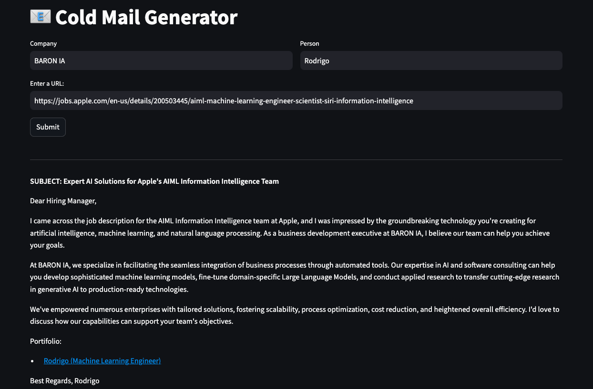

# 📧 Cold Mail Generator



The tool generate cold email from a job description. First extract the job information and key points such required experience and skills, then use you company and you name to write an cold email from the job description.

## Run
1. Copy `.env.example` to `.env` then set yout keys.

1. Install the dependecies:
```commandline
    pip install -r requirements.txt
```

1. Start the Streamlit server:
```commandline
    streamlit run main.py --server.address 0.0.0.0 --server.port 5000
```

## References

This is a project inspirated from the (codebasics repo)[https://github.com/codebasics/project-genai-cold-email-generator]
