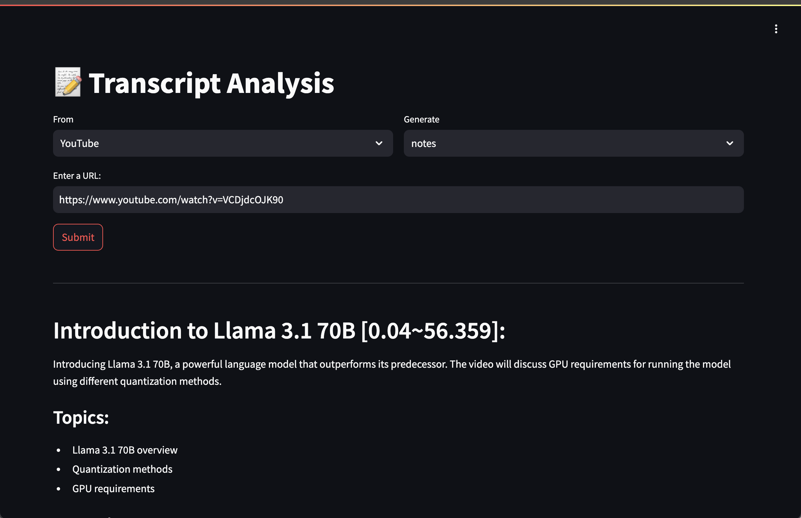

# 📝 Transcript Analysis



The tool extract transcripts from YouTube videos, or from file and process to generate **summary**, **chapters**, and **notes**.

## Run
1. Copy `.env.example` to `.env` then set yout keys.

1. Install the dependecies:
```commandline
    pip install -r requirements.txt
```

1. Start the Streamlit server:
```commandline
    streamlit run main.py --server.address 0.0.0.0 --server.port 5000
```

## References

* This is a project inspirated from [Jason Liu](https://python.useinstructor.com/blog/archive/2024/#analyzing-youtube-transcripts-with-instructor)  

